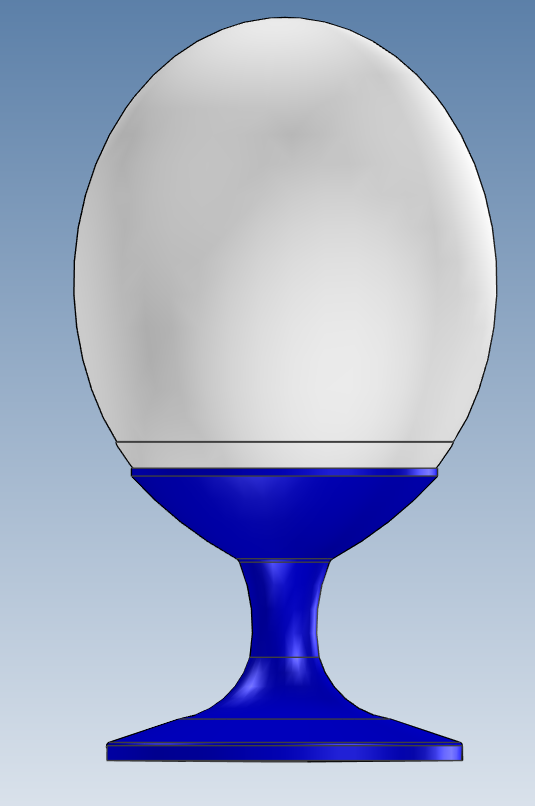

# Ostrich-Easter-egg
3D models, electronics, and firmware for an illuminated Easter egg the size of an ostrich egg. Easter decoration.

 

## Use:

1. RP2040 Zero
2. neoPixel Ring (16 LEDs)

### STEP files contain 3D printable components,
